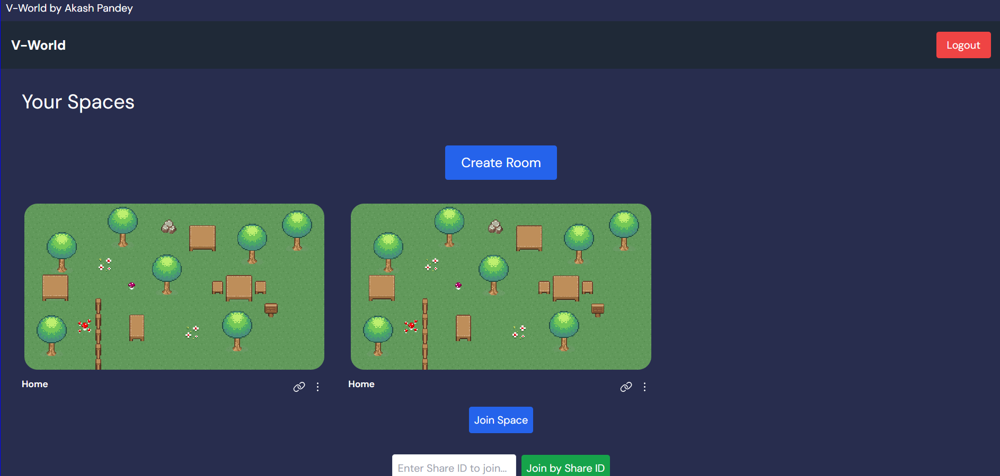
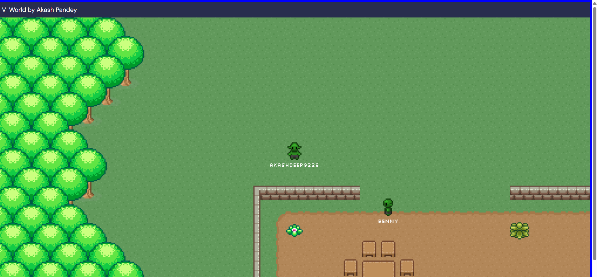
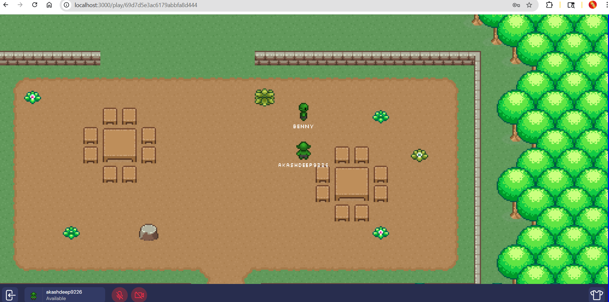

# v-world

A collaborative virtual space app where users can create and customize their own realms (maps), invite others, and interact via chat and video.

## Demo

### v3


### v1


### v2


## Features
- **Create and manage realms:** Users can create, edit, and delete their own virtual spaces.
- **Real-time multiplayer:** Multiple users can join a realm and see each other move in real time.
- **Map editor:** Drag-and-drop editor for customizing rooms, tiles, and special areas.
- **Chat:** Text chat within each realm.
- **Video/voice chat:** Integrated video chat using Agora (or similar service).
- **Authentication:** Sign up, log in, and secure access to realms.

## Tech Stack
- **Frontend:** Next.js (React, TypeScript, Tailwind CSS, PixiJS for rendering)
- **Backend:** Node.js, Express, Socket.IO, MongoDB, Mongoose
- **Real-time:** Socket.IO for player movement, chat, and events
- **Video chat:** Agora (or similar, pluggable)

## Project Structure
```
v-world/
  backend/      # Express API, Socket.IO, MongoDB models
  frontend/     # Next.js app, PixiJS map editor, UI components
```

## Getting Started

### Prerequisites
- Node.js (v16+ recommended)
- MongoDB (local or Atlas)

### Setup
1. **Clone the repo:**
   ```bash
   git clone <repo-url>
   cd v-world
   ```
2. **Install dependencies:**
   ```bash
   cd backend && npm install
   cd ../frontend && npm install
   ```
3. **Configure environment variables:**
   - Copy `.env.example` to `.env` in both `backend/` and `frontend/` (create if missing).
   - Set `MONGODB_URI`, `JWT_SECRET`, and `FRONTEND_URL` in backend `.env`.
   - Set `NEXT_PUBLIC_BACKEND_URL` in frontend `.env`.
4. **Start MongoDB:**
   - If local: `mongod`
5. **Run the backend:**
   ```bash
   cd backend
   npm run dev
   # or
   yarn dev
   ```
6. **Run the frontend:**
   ```bash
   cd frontend
   npm run dev
   # or
   yarn dev
   ```
7. **Open the app:**
   - Visit [http://localhost:3000](http://localhost:3000)

## Development Notes
- **Sprites:** Character and tile sprites are in `frontend/public/sprites/`.
- **Map data:** Stored in MongoDB as part of each realm.
- **Video chat:** Requires Agora credentials (see frontend video chat utils).
- **Environment variables:**
  - `backend/.env`:
    - `MONGODB_URI`, `JWT_SECRET`, `FRONTEND_URL`
  - `frontend/.env`:
    - `NEXT_PUBLIC_BACKEND_URL`, Agora keys, etc.

## License
This project is proprietary software. All rights reserved. 